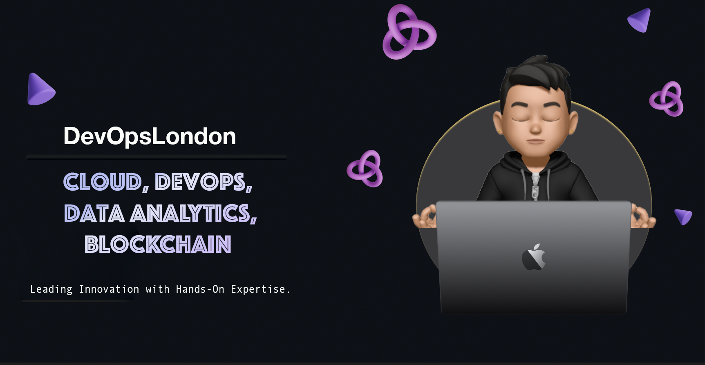

## Hi there 👋

<!--
**devopslondon2021/devopslondon2021** is a ✨ _special_ ✨ repository because its `README.md` (this file) appears on your GitHub profile.
-->

I'm an experienced DevOps and Cloud professional with a strong background in analytics, currently embracing the fascinating world of Blockchain. With over 15 years of experience in the tech industry, I've developed a keen expertise in streamlining operations and enhancing systems with cutting-edge technologies.

Here are some insights into my professional world:

- 🔭 I’m currently focused on writing **comprehensive documentation on DevOps practices within the Web3 space**. My goal is to create clear, insightful guides that demystify complex concepts and systems for everyone from beginners to advanced practitioners.
- 🌱 I’m also learning how to share my knowledge with a wider audience through YouTube tutorials and digital marketing strategies. I aim to make technical knowledge more accessible and engaging to the global tech community.
- 👯 I’m looking to collaborate on projects focused on **cloud-native technologies, especially Kubernetes and serverless architectures**.
- 🤔 I’m looking for help with understanding the intricacies of smart contract development and effective DApp integration.
- 💬 Ask me about anything related to **DevOps transformations, cloud solutions, data analytics, or the emerging Blockchain trends**.
- 😄 Pronouns: He/Him
- ⚡ Fun fact: I'm an excellent cook, especially when it comes to chicken curry! When I'm not tinkering with technology, I'm an explorer with my camera in hand, capturing the world one snapshot at a time.

Feel free to reach out if you have any questions or need collaboration on a project!
